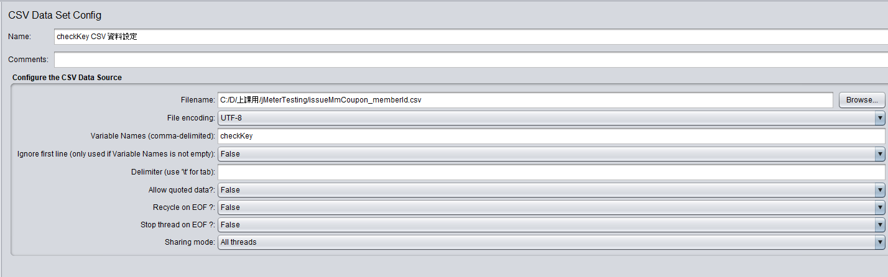

# JMeter 壓力測試心得報告

---

## 一、報告怎麼開始（開場 1–2 分鐘）

在實際開發中，我們常常只確認功能是否正常，  
例如 API 能不能成功呼叫、資料是否正確處理。

但當實際使用情境變成「同時間有大量使用者一起操作」時，  
系統是不是還能撐得住，其實很難只靠直覺判斷。

因此這次我使用 **Apache JMeter**，  
來模擬多使用者同時請求的情境，  
實際觀察系統在不同負載下的反應，  
並從測試結果中學習如何解讀效能表現與可能的瓶頸。

---

## 二、測試背景與目的

### 為什麼要做壓力測試

- 功能正常不代表在高流量下仍然穩定
- 實際業務中可能同時間有大量使用者操作
- 壓力測試可以在上線前提前發現潛在風險

---

### 測試的系統是什麼

- 測試對象：API  
- 功能內容：發放折價券  
- 測試型態：模擬多會員同時請求 API  

---

### 實際業務情境

- 同時間有大量會員進行操作
- 系統需要同時處理多筆發券請求
- 若系統無法承受，可能導致：
  - 回應變慢
  - 發券失敗
  - 系統錯誤

---

### 本次測試想回答的問題

- 系統最多可以承受多少使用者同時請求？
- 在使用者數提高時，回應時間是否仍可接受？
- 高負載情況下是否會出現錯誤（timeout、500 error）？

---

## 三、JMeter 測試設計

### 測試方式說明

- 使用本機啟動 JMeter GUI mode（jmeter.sh）
- 以 HTTP Request 模擬 API 呼叫
- 透過 Thread Group 模擬多使用者行為

---

### Thread Group 設定

- 使用者數（Number of Threads）
- Ramp-Up Time
- Loop Count

（可搭配簡單架構圖或設定截圖）

---

### HTTP Request 設定

- API URL
- Method（POST）
- Request Body（發放折價券資料）

---

### 變數設定

- CSV Data Set Config
  - 事先準備會員資料檔
  - 每個 Thread 讀取不同會員資料
  - 避免重複會員造成測試失真

### CSV Data Set Config 欄位說明

| 欄位 (Field) | 用途說明 |
| :--- | :--- |
| **Filename** | CSV 檔案的完整路徑或相對路徑。這是 JMeter 讀取資料的來源檔案。 |
| **File encoding** | 檔案的編碼格式，例如 `UTF-8`、`Big5`。如果 CSV 檔內有中文或特殊字元，請務必設定正確的編碼，以免亂碼。 |
| **Variable Names** | 定義 CSV 中各欄位對應的變數名稱，多個變數用逗號 `,` 分隔。例如，如果 CSV 有兩欄 `username,password`，這裡就填 `user,pwd`，在後續的請求中就可以用 `${user}` 和 `${pwd}` 來取值。 |
| **Ignore first line** | 如果 CSV 檔案的第一行是標頭 (Header)，可以將此欄位設為 `True`，JMeter 會忽略第一行，從第二行開始讀取資料。 |
| **Delimiter** | 欄位之間的分隔符號。預設是逗號 `,`，也可以是 Tab (`\t`) 或其他自訂符號。 |
| **Allow quoted data?** | 是否允許資料值被引號 `"` 包住。如果設定為 `True`，JMeter 會正確解析 "value1","value2" 這樣格式的資料。 |
| **Recycle on EOF?** | End of File (EOF) 時是否要從頭循環讀取？如果設定為 `True`，當所有執行緒 (Thread) 讀完檔案後，會回到第一筆資料重新開始。 |
| **Stop thread on EOF?** | End of File (EOF) 時是否要停止該執行緒？如果設定為 `True`，執行緒讀完一筆資料後，如果沒有更多資料可讀，該執行緒就會結束執行。`Recycle on EOF?` 和 `Stop thread on EOF?` 通常是二選一。 |
| **Sharing mode** | 設定 CSV 檔案的共享模式： |
| | **All threads**: 所有執行緒共享同一個檔案，每個執行緒會依序讀取檔案中的下一筆資料 (最常用)。 |
| | **Current thread group**: 檔案僅在當前的執行緒群組 (Thread Group) 內共享。 |
| | **Current thread**: 每個執行緒獨立開啟並讀取自己的檔案。 |

---

## 四、測試結果與指標解讀（重點）

> 本段重點不在單一數字，而是系統行為的趨勢。

### 觀察指標

- Average Response Time  
- 90% / 95% Response Time  
- Throughput  
- Error Rate  

---

### 結果觀察重點

- 使用者數增加時，回應時間的變化情況
- Throughput 是否隨負載成長
- 是否在高負載下開始出現錯誤

（可搭配 Summary Report 截圖）

---

## 五、我的 JMeter 測試方法能做到什麼 / 不能做到什麼

> 本次測試以前述測試設計與環境為前提。

---

### 能做到的事情

模擬真實的多會員同時發券情境

- 每個 Thread 對應一位不同會員
- 使用事先準備的會員資料檔
- 貼近實際業務使用情況

觀察系統在不同負載下的行為趨勢

- 回應時間是否隨負載上升
- 何時開始不穩定或出錯

提前發現明顯的效能與穩定性問題

- timeout
- 500 error
- 中等負載即明顯變慢的情況

驗證 API 在高併發下的基本行為是否合理

- 發券流程是否正常完成
- 是否出現異常行為

---

### 不能做到的事情

無法精準給出系統最大可承受使用者數

- JMeter 以本機 GUI mode 執行
- 本機效能可能先成為瓶頸

測試結果不等同正式上線環境

- 測試環境與正式環境在資源與配置上不同
- 結果僅能作為趨勢與參考

無法單靠 JMeter 判斷效能瓶頸來源

- 無法判斷是 CPU、Memory、DB 或 Network 問題
- 需搭配 Server 端監控工具

不適合大規模或長時間壓力測試

- GUI mode 適合測試設計與初步驗證
- 不適合作為最終壓測方案

---

## 六、總結

本次透過 JMeter 模擬多會員同時發放折價券的情境，  
能在上線前觀察系統在不同負載下的行為與風險。

雖然目前的測試方式無法精準給出系統的最大承載上限，  
但已能作為後續效能優化與正式壓力測試的重要基礎。
